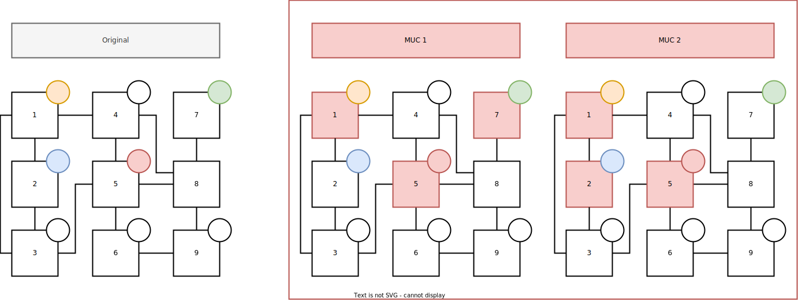

# Example : Graph coloring

+ This example encodes the classic graph coloring problem together with an unsatisfiable instance
+ Here for the sake of illustration some of the graph nodes are already assigned a color from the start, which is where the conflict occurs
+ Using `clingexplaid` we can discover the underlying Minimal Unsatisfiable Cores (MUCs) and their respective unsatisfiable constraints


## Visualization



## Run

+ Finding all MUCs

    ```bash
    clingexplaid 0 encoding.lp instance.lp --muc -a assign/3
    ```
  
    Expected Output:

    ```bash
    MUC  1 
    assign(1,green) assign(5,red) assign(7,green)
    MUC  2 
    assign(1,green) assign(2,blue) assign(5,red)
    ```

+ Finding the unsatisfiable constraints

    ```bash
    clingexplaid 0 encoding.lp instance.lp --unsat-constraints
    ```

    Expected Output:

    ```bash
    Unsat Constraints 
    :- edge(N1,N2); assign(N1,C); assign(N2,C).
    ```

+ Combined call with unsatisfiable constraints for every found MUC
  ```bash
  clingexplaid 0 encoding.lp instance.lp --muc --unsat-constraints -a assign/3
  ```
  
  Expected Output:

    ```bash
    MUC  1 
    assign(1,green) assign(5,red) assign(7,green)
    ├── Unsat Constraints 
    ├──:- edge(N1,N2); assign(N1,C); assign(N2,C).
    MUC  2 
    assign(1,green) assign(2,blue) assign(5,red)
    ├── Unsat Constraints 
    ├──:- edge(N1,N2); assign(N1,C); assign(N2,C).
    ```

